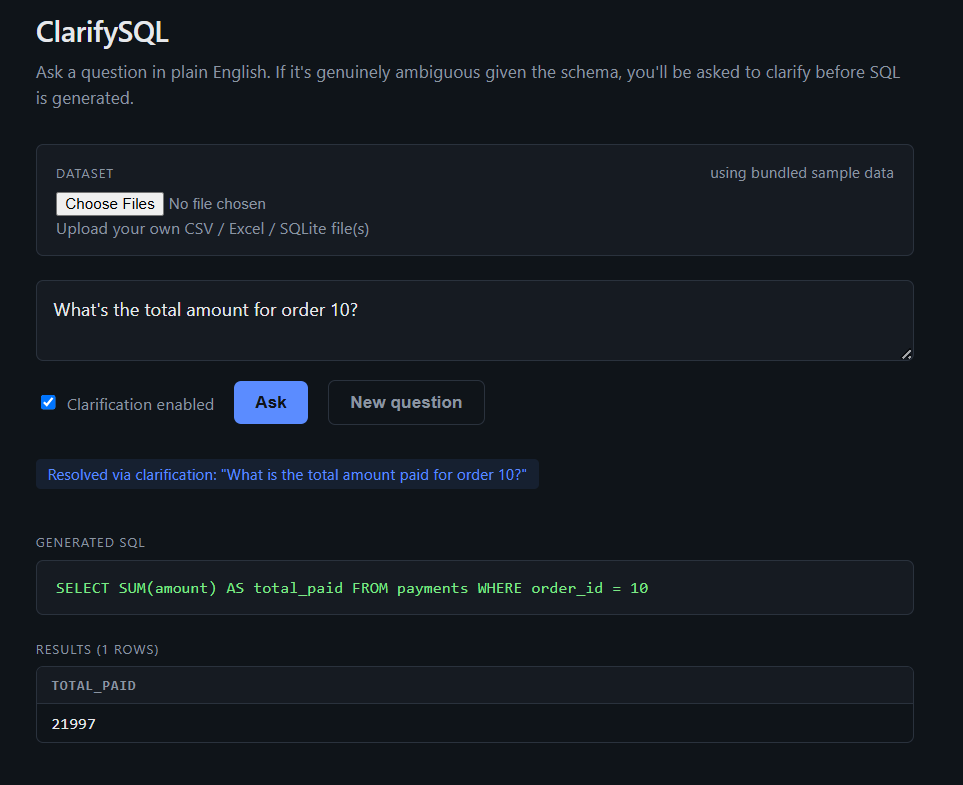

# ClarifySQL

Converts natural-language questions into SQL, but instead of guessing when a
question is ambiguous, it detects the ambiguity and asks a targeted
clarifying question first. Includes an evaluation harness that measures
execution accuracy **with vs. without** clarification, on a test set that
deliberately mixes clear and ambiguous questions.

Runs Llama models through **Groq** by default (free tier, cloud-hosted,
very fast) and falls back automatically to **Ollama** (fully local/offline)
or **Anthropic** (paid) depending on what's configured. See "Provider setup"
below for the priority order and how to force a specific one.



## Why a clarification engine?

Most text-to-SQL demos are one-shot: NL in, SQL out, hope for the best. Real
schemas are full of overlap — a column like `amount` or `status` can live in
two tables with different meanings, or a question like "top products" has no
fixed number attached. A one-shot system silently picks *an* interpretation,
which may not be the one the user meant. This project adds a lightweight
ambiguity-detection step that asks a single, targeted question before
generating SQL when (and only when) the schema genuinely supports more than
one reasonable interpretation.

## Architecture

```
NL question
    │
    ▼
[clarification_engine.check_ambiguity]  <- schema-grounded LLM call, strict JSON
    │
    ├── not ambiguous ──────────────────┐
    │                                   ▼
    └── ambiguous                [sql_generator.generate_sql]
            │                           ▲
            ▼                           │
      ask_fn(question) ──> answer ──────┘
      (human via CLI or web UI, or looked-up answer during eval)
            │
            ▼
   clarification_engine.resolve_with_answer
   (folds Q&A into one fully-specified question)
```

```
ClarifySQL/
├── config.py                 # provider + model config
├── setup_db.py                # builds & seeds the sample SQLite DB
├── cli.py                     # interactive CLI
├── db/
│   └── schema.sql              # schema with intentional column overlap
├── src/
│   ├── llm_client.py           # Groq / Ollama / Anthropic adapter
│   ├── schema_utils.py         # live schema introspection for prompts
│   ├── clarification_engine.py # ambiguity detection + question generation
│   ├── sql_generator.py        # NL -> SQL, with self-repair on failure
│   ├── sql_executor.py         # safe (read-only) SQL execution
│   └── pipeline.py             # orchestrates the two flows
├── eval/
│   ├── test_queries.json       # 16 questions: 8 clear, 8 ambiguous
│   └── evaluate.py              # runs both flows, reports accuracy delta
└── web/
    ├── backend/
    │   ├── main.py               # FastAPI: /api/ask, /api/resolve, /api/upload
    │   └── dataset_loader.py     # CSV/Excel/SQLite upload -> queryable DB
    └── frontend/
        └── src/App.jsx           # single-page UI: ask -> clarify -> results
```

## Provider setup

`T2SQL_PROVIDER=auto` (the default) picks the first available provider in
this order:

| Priority | Provider  | Why | Setup |
|---|---|---|---|
| 1 | **Groq**   | Free tier, cloud, runs Llama very fast (this is why it's first — same models, way less waiting than local CPU inference) | `export GROQ_API_KEY=gsk_...` |
| 2 | **Ollama** | Free, fully local/offline — nothing leaves your machine, good when you don't want to send data over the network or don't have a Groq key | Install Ollama, `ollama pull llama3.1:8b` |
| 3 | **Anthropic** | Paid, no standing free tier | `export ANTHROPIC_API_KEY=sk-ant-...` |

You can also force one explicitly instead of auto-detecting:
```bash
export T2SQL_PROVIDER=groq       # or ollama, or anthropic
```

### Option A: Groq (recommended — free & fast)

1. Create a free account and API key at https://console.groq.com/keys
2. Copy `.env.example` to `.env` and paste your key in:
   ```bash
   cp .env.example .env
   ```
   Then edit `.env`:
   ```
   GROQ_API_KEY=gsk_your_key_here
   ```
   `.env` is loaded automatically by `config.py` — no extra package, no
   manual `export`/`set` needed, and it's already in `.gitignore` so the
   key won't get committed if you push this to GitHub.
3. Nothing else to install — `llm_client.py` talks to Groq's REST API
   directly with no extra Python package.

### Option B: Ollama (fully offline)

- Download from https://ollama.com and install
- Pull a model:
  ```bash
  ollama pull llama3.1:8b
  ```
- Ollama runs its server automatically in the background on
  `http://localhost:11434`. Verify with `ollama list`.
- If your machine is RAM-constrained, `llama3.2:3b` is smaller/faster but
  noticeably less reliable at following the strict-JSON instructions this
  project depends on — expect more clarification/generation misses with it.

### Option C: Anthropic (paid)

```bash
pip install anthropic
export ANTHROPIC_API_KEY=sk-ant-...
export T2SQL_PROVIDER=anthropic
```

### Install Python deps

```bash
pip install -r requirements.txt
```

(Groq and Ollama both work with zero extra packages — `anthropic` is only
needed if you use that provider.)

### Build the sample database

```bash
python setup_db.py
```

Creates `db/sample.db`: an e-commerce schema (customers, products, orders,
order_items, payments, reviews) with realistic overlapping column names
(`amount`, `status`, `date`, `name` each appear in 2+ tables) so the
clarification engine has real ambiguity to catch — not contrived examples.

## Usage

### Interactive CLI

```bash
python cli.py                 # clarification ON (default)
python cli.py --no-clarify    # direct generation, no clarification step
```

Example session:
```
You: What's the total amount for order 10?

  Clarifying question: Do you mean the order total from the orders table,
  or the amount actually paid according to the payments table?
  Your answer: the order total

--- Generated SQL ---
SELECT amount FROM orders WHERE order_id = 10

(clarification used -> resolved question: "What is the order total, from
the orders table, for order 10?")

--- Results ---
amount
----------------------------------------
(4499.0,)
```

### Run the accuracy evaluation

```bash
python -m eval.evaluate --verbose
```

This runs all 16 test questions through both pipelines (clarification
disabled vs. enabled — with simulated answers so it runs unattended), scores
each by executing the generated SQL and comparing result sets against a
known-correct query, and prints a summary like:

```
============================================================
RESULTS
============================================================
Overall accuracy WITHOUT clarification: 62.5%  (16 queries)
Overall accuracy WITH clarification:    93.8%  (16 queries)

On AMBIGUOUS queries (n=8):
   without clarification: 25.0%
   with clarification:    87.5%
   -> delta: +62.5 points

On UNAMBIGUOUS queries (n=8):
   without clarification: 100.0%
   with clarification:    100.0%
   -> delta: +0.0 points
============================================================
```

(Numbers above are illustrative — actual results depend on the model you
run. Full per-question results are written to `eval/results.json`.)

**Why this metric design matters for your resume/interview story:** the
split between ambiguous and unambiguous questions is the key result — it
isolates *where* clarification actually helps (ambiguous questions) vs.
confirms it doesn't regress performance on questions that didn't need it.
A single blended accuracy number would hide that.

## Two accuracy-relevant details worth knowing for interviews

**Self-repair loop.** If generated SQL fails to execute (bad column
reference, invalid nested aggregate, etc.), `sql_generator.py` feeds the
exact database error back to the model and gives it one retry
(`T2SQL_REPAIR_ATTEMPTS`, default 1) before giving up. This catches a
meaningful chunk of real generation errors — "here is the exact error, fix
it" is a much stronger signal than the original prompt alone.

**Column-flexible scoring.** The evaluator's `results_match` compares
result sets by value-content per row, not by exact column count/order. A
model that writes `SELECT *` when only two columns were asked for isn't
penalized as long as the actual data is correct and the row count matches
— row count mismatches (wrong filtering) still fail. Worth mentioning if
asked how you validated the accuracy numbers, since naive tuple-equality
scoring would understate accuracy.

## Web UI

A minimal web UI is included under `web/` — a FastAPI backend that wraps
the existing pipeline (no logic duplicated) and a small React frontend.
Useful for demoing this without anyone needing to touch a terminal.

```
web/
├── backend/
│   ├── main.py            # FastAPI app: /api/ask, /api/resolve, /api/health
│   └── requirements.txt
└── frontend/
    ├── package.json
    └── src/
        ├── App.jsx         # single-page form -> clarify -> results flow
        └── App.css
```

### Run it

**Backend** (from the project root):
```bash
cd web/backend
pip install -r requirements.txt
uvicorn main:app --reload --port 8000
```

**Frontend** (in a second terminal):
```bash
cd web/frontend
npm install
npm run dev
```

Then open http://localhost:5173. The frontend talks to the backend at
`http://localhost:8000` (hardcoded in `App.jsx` for simplicity — this is a
demo, not a deployed service).

### How it works

1. **(Optional) Upload your own data** — click the upload box and pick one
   or more `.csv`, `.xlsx`, or a single `.db`/`.sqlite` file. Each CSV or
   Excel sheet becomes its own table, so multi-file uploads can be
   joined across in your questions. This is a real, dynamic conversion —
   the schema, clarification questions, and generated SQL all adapt to
   whatever tables/columns you uploaded, exactly the same way they adapt
   to the bundled sample schema. Nothing about the pipeline is hardcoded
   to the sample e-commerce data; that's just the default when no dataset
   is uploaded.
2. Type a question, submit. `/api/ask` checks ambiguity (if clarification
   is enabled) and either returns a clarifying question or goes straight
   to SQL.
3. If clarification is needed, answer it inline. `/api/resolve` folds your
   answer back in and generates the final SQL.
4. Generated SQL and results render below, with a badge showing when
   clarification was used and what question it resolved to.

Uploaded datasets are held in memory (a temp SQLite file per session) and
are **not persisted** — restarting the backend clears them, and you'd need
to re-upload. This is a deliberate simplicity tradeoff for a portfolio demo,
not a production data-handling design.

The backend does not persist question history — every request is
stateless, matching the eval harness's design (the frontend just holds the
original question and the active session_id in React state between calls).

## Deployment

Deployed as two separate pieces: **backend on Render** (free tier, keeps a
Python process alive), **frontend on Vercel** (free, static React build).
Ollama doesn't work in this setup — it needs a local process on your own
machine — so the deployed backend is forced onto Groq via
`T2SQL_PROVIDER=groq`.

### Backend (Render)

1. Push this repo to GitHub (already done if you're reading this on GitHub).
2. In Render, **New > Blueprint**, connect this repo. It reads
   [`render.yaml`](render.yaml) automatically and configures the build/start
   commands for you.
3. Render will prompt for the two secrets marked `sync: false` in
   `render.yaml`:
   - `GROQ_API_KEY` — your Groq key
   - `ALLOWED_ORIGINS` — leave blank for now, come back and set this after
     step 2 of the frontend deploy below (needs the Vercel URL first)
4. Deploy. You'll get a URL like `https://clarifysql-api.onrender.com`.
   Confirm it's alive: `https://clarifysql-api.onrender.com/api/health`
   should return `{"ok": true, "provider": "groq"}`.

**Free-tier note:** Render's free web services spin down after 15 minutes
of no traffic and take ~30-60 seconds to wake back up on the next request.
The first request after idle time will be slow — this is Render's
limitation, not a bug in this project.

### Frontend (Vercel)

1. In Vercel, **New Project**, import this repo, set **Root Directory** to
   `web/frontend` (Vercel auto-detects the Vite framework from there via
   `vercel.json`).
2. Add an environment variable: `VITE_API_BASE` = your Render URL from
   above (e.g. `https://clarifysql-api.onrender.com`).
3. Deploy. You'll get a URL like `https://clarifysql.vercel.app`.
4. Go back to Render and set `ALLOWED_ORIGINS` to that Vercel URL, so the
   backend only accepts requests from your actual deployed frontend rather
   than any origin. Redeploy the backend for it to take effect.

### Verifying it worked

Open your Vercel URL, ask an unambiguous question first (confirms the
backend connection and Groq key both work), then an ambiguous one
(confirms the full clarification round-trip). If the first request hangs
for 30-60 seconds, that's Render's free-tier cold start, not an error --
wait it out once, subsequent requests are fast.

### A known limitation of this deployment

Uploaded datasets (`/api/upload`) are held in memory on the backend, and
Render's free tier can restart your service on redeploys or extended idle
periods, which clears them — same limitation as running locally, just more
likely to happen since Render manages the process lifecycle for you. Not a
bug, just worth knowing if a demo dataset disappears and needs re-uploading.

## Safety note

`sql_executor.py` only allows read-only `SELECT`/`WITH` statements and
blocks `DROP`/`DELETE`/`UPDATE`/`INSERT`/`ALTER`/etc. This matters because
the SQL is LLM-generated — never execute untrusted generated SQL against a
database without a guard like this, even for a demo project.

## Ideas for extending this further

- Add a confidence score alongside the ambiguity flag, and only clarify
  below a threshold (tunable precision/recall tradeoff).
- Add a second evaluation axis: exact-match accuracy on the
  `clarification_question` wording quality (harder to score automatically,
  but relevant if you want to discuss it in interviews).
- Swap the fixed test set for the Spider benchmark subset for a more
  standard, citable accuracy number.
- Add multi-turn clarification (more than one round) for genuinely
  underspecified questions.
